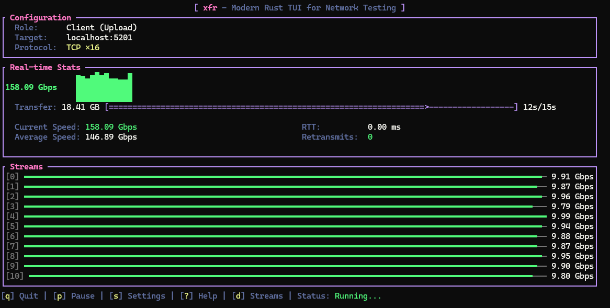

# xfr

<p align="center">
  
</p>

A modern iperf3 alternative with a live TUI, multi-client server, MPTCP, and QUIC support. Built in Rust.

[](https://crates.io/crates/xfr)
[](https://github.com/lance0/xfr/actions/workflows/ci.yml)
[](LICENSE-MIT)
[](https://ko-fi.com/lance0)

## Quick Start

```bash
# Server
xfr serve

# Client (in another terminal or machine)
xfr 192.168.1.1              # Basic TCP test
xfr 192.168.1.1 -b 100M      # TCP at 100 Mbps
xfr 192.168.1.1 -P 4         # 4 parallel streams
xfr 192.168.1.1 -u -b 1G     # UDP at 1 Gbps
```

See [Installation](#installation) below for setup instructions.

## TUI Preview

<p align="center">
  
</p>

## Features

- **Live TUI** with real-time throughput graphs and per-stream stats
- **Server dashboard** - `xfr serve --tui` for monitoring active tests
- **Multi-client server** - handle multiple simultaneous tests
- **TCP, UDP, QUIC, and MPTCP** with configurable bitrate pacing and parallel streams
- **Firewall-friendly** - single-port TCP, QUIC multiplexing, and `--cport` for pinning UDP/QUIC source ports
- **Bidirectional testing** - measure upload and download simultaneously
- **Multiple output formats** - plain text, JSON, JSON streaming, CSV
- **Result comparison** - `xfr diff` to detect performance regressions
- **LAN discovery** - find xfr servers with mDNS (`xfr discover`)
- **Prometheus metrics** - export stats for monitoring dashboards
- **Config file** - save defaults in `~/.config/xfr/config.toml`
- **Environment variables** - `XFR_PORT`, `XFR_DURATION` overrides

### vs iperf3

| Feature | iperf3 | xfr |
|---------|--------|-----|
| Live TUI | No | Yes (client & server) |
| Multi-client server | No | Yes |
| MPTCP | No | Yes (auto on server, `--mptcp` on client, Linux 5.6+) |
| Firewall-friendly | `--cport` (TCP/UDP) | Single-port TCP + `--cport` (UDP/QUIC) |
| Output formats | Text/JSON | Text/JSON/CSV |
| Prometheus metrics | No | Yes (optional feature) |
| Compare runs | No | `xfr diff` |
| LAN discovery | No | `xfr discover` |
| Config file | No | Yes |

## Real-World Use Cases

### VPN Tunnel Testing
Measure actual throughput through your VPN:
```bash
# On VPN server
xfr serve

# From client, through VPN
xfr 10.8.0.1 -t 30s
```

### UDP Congestion Detection
Test UDP at your expected rate to detect packet loss:
```bash
xfr <host> -u -b 500M -t 60s    # Watch for loss percentage in TUI
```

### Before/After Comparison
Quantify the impact of network changes:
```bash
xfr <host> --json -o before.json
# ... make changes ...
xfr <host> --json -o after.json
xfr diff before.json after.json --threshold 5
```

### Multi-Stream for Bonded Connections
Test aggregate bandwidth across bonded/LACP interfaces:
```bash
xfr <host> -P 8 -t 30s          # 8 streams to utilize all links
```

### Prometheus Monitoring
Continuous performance monitoring:
```bash
xfr serve --prometheus 9090 --push-gateway http://pushgateway:9091
# Scrape metrics or view in Grafana
```

## Installation

### From crates.io (Recommended)

Requires [Rust 1.88+](https://www.rust-lang.org/tools/install):

```bash
# Install Rust (if not already installed)
curl --proto '=https' --tlsv1.2 -sSf https://sh.rustup.rs | sh
source ~/.cargo/env

# Install xfr
cargo install xfr
```

### Homebrew (macOS/Linux)

```bash
brew install lance0/tap/xfr
```

### Pre-built Binaries

Download from [GitHub Releases](https://github.com/lance0/xfr/releases):

| Platform | Target |
|----------|--------|
| Linux x86_64 | `xfr-x86_64-unknown-linux-musl.tar.gz` |
| Linux ARM64 | `xfr-aarch64-unknown-linux-gnu.tar.gz` |
| macOS Apple Silicon | `xfr-aarch64-apple-darwin.tar.gz` |
| macOS Intel | Use `cargo install xfr` |
| Android (Termux) | `xfr-aarch64-linux-android.tar.gz` |
| Windows | Use WSL2 (native support is experimental) |

```bash
# Example: Linux x86_64
curl -LO https://github.com/lance0/xfr/releases/latest/download/xfr-x86_64-unknown-linux-musl.tar.gz
tar xzf xfr-*.tar.gz && sudo mv xfr /usr/local/bin/
```

### eget

```bash
eget lance0/xfr
```

### Arch Linux (AUR)

```bash
yay -S xfr-bin
```

### From Source

```bash
git clone https://github.com/lance0/xfr
cd xfr && cargo build --release
sudo cp target/release/xfr /usr/local/bin/
```

### Quick Install Script

> **Note**: Review scripts before piping to sh. See the [install script](install.sh) source.

```bash
curl -fsSL https://raw.githubusercontent.com/lance0/xfr/master/install.sh | sh
```

### Termux (Android)

Download the `aarch64-linux-android` binary from [releases](https://github.com/lance0/xfr/releases), or build from source:

```bash
pkg install rust
cargo install xfr
```

### NetBSD

Available via [pkgsrc](https://pkgsrc.se/net/xfr):

```bash
pkgin install xfr
```

### Optional Features

| Feature | Default | Description |
|---------|---------|-------------|
| `discovery` | Yes | mDNS LAN discovery (`xfr discover`) |
| `prometheus` | No | Prometheus metrics endpoint and Push Gateway support |

```bash
cargo install xfr --features prometheus    # Prometheus support
cargo install xfr --all-features           # All features
```

### Shell Completions

```bash
# Bash
xfr --completions bash > ~/.local/share/bash-completion/completions/xfr

# Zsh (add ~/.zfunc to fpath in .zshrc first)
xfr --completions zsh > ~/.zfunc/_xfr

# Fish
xfr --completions fish > ~/.config/fish/completions/xfr.fish

# PowerShell (add to $PROFILE)
xfr --completions powershell >> $PROFILE

# Elvish
xfr --completions elvish > ~/.elvish/lib/xfr.elv
```

## Usage

### Server

```bash
xfr serve                    # Listen on port 5201
xfr serve -p 9000            # Custom port
xfr serve --tui              # Live dashboard showing active tests
xfr serve --one-off          # Exit after one test
xfr serve --max-duration 60s # Limit test duration
xfr serve --push-gateway http://pushgateway:9091  # Push metrics on test complete
xfr serve --psk mysecret     # Require PSK authentication
xfr serve --rate-limit 2     # Max 2 concurrent tests per IP
xfr serve --allow 192.168.0.0/16 --deny 0.0.0.0/0  # IP ACL
```

### Client

```bash
xfr 192.168.1.1              # TCP test, 10s, single stream
xfr 192.168.1.1 -t 30s       # 30 second test
xfr 192.168.1.1 -P 4         # 4 parallel streams
xfr 192.168.1.1 -R           # Reverse (download test)
xfr 192.168.1.1 --bidir      # Bidirectional
xfr 192.168.1.1 -6           # Force IPv6 only
xfr ::1 -6                   # IPv6 localhost
```

### UDP Mode

```bash
xfr 192.168.1.1 -u           # UDP mode
xfr 192.168.1.1 -u -b 1G     # UDP at 1 Gbps
xfr 192.168.1.1 -u -b 100M   # UDP at 100 Mbps
```

### QUIC Mode

```bash
xfr 192.168.1.1 --quic       # QUIC transport (encrypted)
xfr 192.168.1.1 --quic -P 4  # QUIC with 4 parallel streams
xfr 192.168.1.1 --quic -R    # QUIC download test
```

QUIC provides built-in TLS 1.3 encryption with stream multiplexing over a single connection.

**Security Note:** QUIC encrypts traffic but does not verify server identity by default. For authenticated connections, use `--psk` on both client and server to prevent MITM attacks.

### MPTCP Mode

```bash
xfr 192.168.1.1 --mptcp       # MPTCP (Multi-Path TCP, Linux 5.6+)
xfr 192.168.1.1 --mptcp -P 4  # MPTCP with 4 parallel streams
xfr 192.168.1.1 --mptcp -R    # MPTCP download test
```

MPTCP enables a single connection to use multiple network paths simultaneously (e.g., WiFi + Ethernet). The server automatically creates MPTCP listeners — no flag needed on the server side. All TCP features (nodelay, congestion control, window size, bidir, multi-stream) work transparently with MPTCP.

### Output Formats

```bash
xfr <host> --json              # JSON summary
xfr <host> --json-stream       # JSON per interval (for scripting)
xfr <host> --csv               # CSV output
xfr <host> -q                  # Quiet mode (summary only)
xfr <host> -o results.json     # Save to file
xfr <host> --no-tui            # Plain text, no TUI
xfr <host> --timestamp-format iso8601  # ISO 8601 timestamps
```

**Note:** Log messages go to stderr, allowing clean JSON/CSV piping: `xfr <host> --json 2>/dev/null`

### Interval Control

```bash
xfr <host> -i 2                # Report every 2 seconds
xfr <host> --omit 3            # Skip first 3s of intervals (TCP ramp-up)
```

### Compare Results

```bash
xfr diff baseline.json current.json
xfr diff baseline.json current.json --threshold 5
```

### Discovery

```bash
xfr discover                 # Find xfr servers on LAN
xfr discover --timeout 10s   # Extended search
```

## Keybindings (Client TUI)

| Key | Action |
|-----|--------|
| `q` | Quit (cancels test) |
| `p` | Pause/Resume display |
| `s` | Settings modal |
| `t` | Cycle color theme |
| `d` | Toggle per-stream view |
| `?` / `F1` | Help |
| `j` | Print JSON result |
| `u` | Dismiss update notification |

## Keybindings (Server TUI)

| Key | Action |
|-----|--------|
| `q` | Quit server |
| `?` / `F1` | Help |
| `Esc` | Close help |

## Themes

xfr includes 11 built-in color themes. Select with `--theme` or press `t` during a test:

```bash
xfr <host> --theme dracula     # Dark purple theme
xfr <host> --theme matrix      # Green on black hacker style
xfr <host> --theme catppuccin  # Soothing pastels
xfr <host> --theme nord        # Arctic blue tones
```

Available themes: `default`, `kawaii`, `cyber`, `dracula`, `monochrome`, `matrix`, `nord`, `gruvbox`, `catppuccin`, `tokyo_night`, `solarized`

Your theme preference is auto-saved to `~/.config/xfr/prefs.toml`.

## Configuration

xfr reads defaults from `~/.config/xfr/config.toml`:

```toml
[client]
duration_secs = 10
parallel_streams = 1
tcp_nodelay = false
json_output = false
no_tui = false
theme = "default"  # or dracula, catppuccin, nord, matrix, etc.
timestamp_format = "relative"  # or "iso8601", "unix"
log_file = "~/.config/xfr/xfr.log"
log_level = "info"

[server]
port = 5201
push_gateway = "http://pushgateway:9091"
log_file = "~/.config/xfr/xfr-server.log"
log_level = "info"
psk = "my-secret-key"
rate_limit = 5
allow = ["192.168.0.0/16", "10.0.0.0/8"]
```

Environment variables override config file:

```bash
export XFR_PORT=9000
export XFR_DURATION=30s
```

## Prometheus Metrics

Enable with `--features prometheus`:

```bash
xfr serve --prometheus 9090
```

Metrics available at `http://localhost:9090/metrics`:

- `xfr_bytes_total` - Total bytes transferred
- `xfr_throughput_mbps` - Current throughput
- `xfr_active_tests` - Number of active tests
- `xfr_retransmits_total` - TCP retransmissions

See `examples/grafana-dashboard.json` for a sample Grafana dashboard.

## CLI Reference

| Flag | Short | Default | Description |
|------|-------|---------|-------------|
| `--port` | `-p` | 5201 | Server/client port |
| `--time` | `-t` | 10s | Test duration (use 0 for infinite) |
| `--udp` | `-u` | false | UDP mode |
| `--quic` | `-Q` | false | QUIC mode (encrypted, multiplexed streams) |
| `--bitrate` | `-b` | unlimited | Target bitrate for TCP and UDP (e.g., 1G, 100M). 0 = unlimited |
| `--parallel` | `-P` | 1 | Parallel streams |
| `--reverse` | `-R` | false | Reverse direction (download) |
| `--bidir` | | false | Bidirectional test |
| `--ipv4` | `-4` | false | Force IPv4 only |
| `--ipv6` | `-6` | false | Force IPv6 only |
| `--bind` | | none | Local address to bind (e.g., 192.168.1.100) |
| `--cport` | | none | Client source port for firewall traversal (UDP/QUIC) |
| `--mptcp` | | false | MPTCP mode (client-only, Linux 5.6+; server auto-enables) |
| `--json` | | false | JSON output |
| `--json-stream` | | false | JSON per interval |
| `--csv` | | false | CSV output |
| `--quiet` | `-q` | false | Summary only |
| `--interval` | `-i` | 1.0 | Report interval (seconds) |
| `--omit` | | 0 | Omit first N seconds |
| `--output` | `-o` | stdout | Output file |
| `--no-tui` | | false | Disable TUI |
| `--theme` | | default | Color theme (dracula, nord, matrix, etc.) |
| `--tcp-nodelay` | | false | Disable Nagle algorithm |
| `--window` | | OS default | TCP window size |
| `--congestion` | | OS default | TCP congestion control algorithm (e.g. cubic, bbr, reno) |
| `--timestamp-format` | | relative | Timestamp format (relative, iso8601, unix) |
| `--log-file` | | none | Log file path (e.g., ~/.config/xfr/xfr.log) |
| `--log-level` | | info | Log level (error, warn, info, debug, trace) |
| `--push-gateway` | | none | Prometheus Push Gateway URL (server) |
| `--prometheus` | | none | Prometheus metrics port (server, requires feature) |
| `--psk` | | none | Pre-shared key for authentication |
| `--psk-file` | | none | Read PSK from file |
| `--rate-limit` | | none | Max concurrent tests per IP (server) |
| `--rate-limit-window` | | 60s | Rate limit time window (server) |
| `--completions` | | none | Generate shell completions (bash, zsh, fish, powershell, elvish) |
| `--allow` | | none | Allow IP/subnet, repeatable (server) |
| `--deny` | | none | Deny IP/subnet, repeatable (server) |
| `--acl-file` | | none | ACL rules file (server) |
| `--max-duration` | | none | Maximum test duration, server-side limit (server) |
| `--tui` | | false | Enable live dashboard (server) |
| `--one-off` | | false | Exit after one test (server, works with TCP and QUIC) |

## Security Considerations

### Transport Encryption

| Mode | Encryption | Certificate Verification |
|------|------------|-------------------------|
| TCP | None | N/A |
| UDP | None | N/A |
| QUIC | TLS 1.3 | Disabled by default |

**QUIC mode** (`-Q/--quic`) provides TLS 1.3 encryption but does not verify server certificates, making it vulnerable to MITM attacks without additional authentication. **Always use `--psk` with QUIC on untrusted networks.** Alternatively, use a VPN or SSH tunnel.

### Authentication

PSK authentication (`--psk`) verifies client identity but does not encrypt TCP/UDP traffic. For encrypted + authenticated connections, use QUIC with PSK:

```bash
# Server
xfr serve --psk "secretkey"

# Client (encrypted + authenticated)
xfr <host> -Q --psk "secretkey"
```

### Network Considerations

- **Single-port TCP**: TCP uses single-port mode by default -- control and data connections share port 5201. Data connections are validated against the control connection's IP address, preventing unauthorized access.
- **UDP on untrusted networks**: UDP mode may be susceptible to reflection attacks from spoofed source addresses. Use TCP or QUIC on public networks.
- **Rate limiting**: Use `--rate-limit` on public servers to prevent abuse.
- **ACLs**: Use `--allow`/`--deny` to restrict client access.

### DoS Protections

- **Slow-loris resistance**: New connections must send their first message within 5 seconds, preventing slow-loris attacks from blocking the accept loop.
- **DataHello flood protection**: DataHello messages for unknown test IDs are rejected immediately without allocating resources.
- **Bounded reads**: All control messages are limited to 8KB, preventing memory exhaustion from oversized messages.
- **Capability negotiation**: Client and server exchange capabilities during the Hello handshake (protocol version 1.1), enabling safe feature evolution.
- **Concurrent connection limits**: Server limits concurrent handlers (default 100) to prevent connection floods.

### Server Resource Usage

Each stream allocates 128KB-4MB for buffers depending on speed mode. Memory usage scales with concurrent clients:

| Streams per client | Memory per client | 10 clients |
|-------------------|-------------------|------------|
| 1 (`-P 1`) | 128KB - 4MB | 1.3MB - 40MB |
| 8 (`-P 8`) | 1MB - 32MB | 10MB - 320MB |
| 128 (`-P 128`) | 16MB - 512MB | 160MB - 5GB |

The server limits concurrent handlers (default 100) to prevent resource exhaustion. Use `--rate-limit` to restrict tests per IP.

## Platform Support

| Platform | Status |
|----------|--------|
| Linux x86_64/ARM64 | Full support, pre-built binaries |
| macOS Apple Silicon | Full support, pre-built binaries |
| macOS Intel | Full support, build from crate: `cargo install xfr` |
| Android (Termux) | Full support, pre-built binaries |
| NetBSD | Full support, via pkgsrc: `pkgin install xfr` |
| Windows | Experimental (WSL2 recommended). Native builds work but lack TCP_INFO metrics. |

## Troubleshooting

### Permission denied on port 5201

Use a port above 1024 or run with elevated privileges:

```bash
xfr serve -p 9000
```

### Connection refused

Ensure the server is running and the port is not blocked by a firewall. TCP only requires port 5201 (or your custom port) to be open -- no additional ephemeral data ports are needed. For UDP behind strict firewalls, use `--cport` to pin client source ports, or use QUIC which multiplexes on a single port.

### Low throughput

- Try multiple parallel streams: `-P 4`
- Disable Nagle's algorithm: `--tcp-nodelay`
- Increase TCP window size: `--window 4M`

### UDP packet loss

- Reduce bitrate: `-b 500M`
- Check for network congestion or firewall issues

## Documentation

- [Comparison with iperf3](docs/COMPARISON.md) - Feature matrix and migration guide
- [Scripting & CI/CD](docs/SCRIPTING.md) - Automation, Docker, Prometheus
- [Features Reference](docs/FEATURES.md) - Detailed feature documentation
- [Architecture](docs/ARCHITECTURE.md) - For contributors
- [Changelog](CHANGELOG.md) - Release history
- [Known Issues](KNOWN_ISSUES.md) - Edge cases and limitations
- [Roadmap](ROADMAP.md) - Planned features
- [Contributing](CONTRIBUTING.md) - Development guidelines

## See Also

- [Terminal Trove](https://terminaltrove.com/xfr/) - xfr listing and discovery
- [AUR](https://aur.archlinux.org/packages/xfr-bin) - Arch Linux package (community-maintained)
- [pkgsrc](https://pkgsrc.se/net/xfr) - NetBSD package (community-maintained)

## License

Licensed under either of [Apache License, Version 2.0](LICENSE-APACHE) or [MIT license](LICENSE-MIT) at your option.
